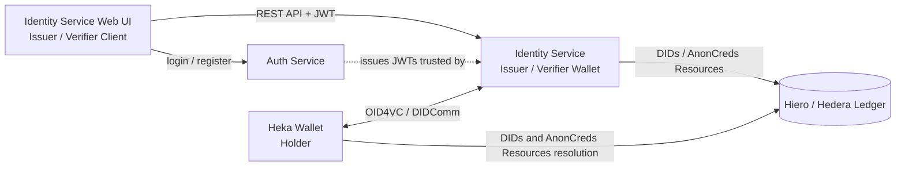

# Heka Identity Platform

The **Heka Identity Platform** is a ready-to-use decentralized identity (aka Self-Sovereign Identity or SSI) solution for the Hiero ecosystem. The project delivers a complete set of applications and tools that enable issuance, management, and verification of verifiable credentials using global identity standards, while serving as a baseline reference implementation for Hiero / Hedera-based identity solutions.

The Heka Identity Platform is intended to speed up adoption of decentralized identity within the Hiero ecosystem and provide a practical, standards-aligned example for developers, integrators, and community members.

## Core Components

The platform is composed of the following components:

- **[Heka Wallet](./heka-wallet)** (Verifiable Credentials Holder): Cross-platform mobile application (built with React Native) for end users to receive, store, and present verifiable credentials.
- **[Identity Service](./heka-identity-service)**: Backend service (built with NestJS) that primarily acts as a Verifiable Credentials Issuer and Verifier, while also supporting Holder capabilities for cloud (custodial) wallet scenarios.
- **[Identity Service Web UI](./heka-identity-service-web-ui)**: Web UI application for Identity Service — allows managing schemas, credential templates, and issuance / verification flows.
- **[Auth Service](./heka-auth-service)**: Authentication service used by the Identity Service for tenant and user authentication.

The implementation is based on the **DSR SSI Toolkit** and leverages well-established open-source frameworks: **OWF Credo** and **OWF Bifold**.

## High-level Architecture

## Getting Started

Each component is set up and run independently. For specific setup and configuration steps, please refer to specific README files in component folders.

The recommended approach for exploring the platform is the following:
- Set up and get familiar with core functional components - [Identity Service](./heka-identity-service) and [Heka Wallet (Mobile application)](./heka-wallet)
- Explore the [Identity Service Web UI](./heka-identity-service-web-ui) and [Auth Service](./heka-auth-service) components. These are more general-purpose applications that still represent a crucial piece for complete experience and testing capabilities
- Once you get familiar with the baseline functionality of a platform, feel free to check out the [demo folder](./demo) to explore various decentralized identity use cases implemented with Heka Identity Platform

## Supported Identity Standards

The platform supports a wide range of global decentralized identity standards, including:

- **Credential Exchange Protocols**: OpenID for Verifiable Credentials (OID4VC), DIDComm
- **Credential Formats**: W3C VC-JWT, W3C VC-JWT JSON-LD, W3C VC with Linked Data Proofs, IETF SD-JWT VC, ISO mDoc (mDL), Hyperledger AnonCreds
- **DID Methods**: `did:key`, `did:peer`, `did:jwk`, `did:web`, `did:indy` (Hyperledger Indy), `did:hedera` (Hiero / Hedera), `did:indybesu` (Indy Besu ledger)

## Agentic AI Integration

Apart from providing support for standard decentralized identity flows, the platform aims to enable use cases that emerge from synergy between identity and Agentic AI.
This includes (but is not limited to) VC-based trust models for AI agents and the Agentic Economy.

Initial supported use cases:

- **VC-based authorization for agents**: [OID4VP In-Task Authorization Extension for Agent2Agent (A2A) protocol](https://github.com/DSRCorporation/a2a-oid4vp-in-task-auth-extension/blob/main/v1/spec.md)

## Roadmap

See [roadmap](./ROADMAP.md) for the platform's planned scope and timeline — covering core maintenance, emerging protocol support, AI / agentic economy integrations, and other development directions.

## Demos

Please see the [demo folder](./demo) to explore demos showcasing various decentralized identity use cases implemented with Heka Identity Platform.

- [Agent-to-Agent (A2A) + OID4VP integration](./demo/a2a-oid4vp): A demo showcasing OID4VP-based authentication for AI agents leveraging Agent2Agent (A2A) protocol

Also, feel free to explore Heka-based demos available on YouTube:

- [Agent2Agent interactions with Just-In-Time authorization via OpenID for Verifiable Credentials](https://www.youtube.com/watch?v=3JgFZBGXXXI)

## Hiero Identity Community

For details and references on how to engage with the Hiero Identity community, please see [Hiero Identity Collaboration Hub repo](https://github.com/hiero-ledger/identity-collaboration-hub).

### LFDT mentorship program

Heka Identity Platform is a core component for an upcoming LFDT mentorship project - [Hiero Contributor Identity Verification Prototype](https://mentorship.lfx.linuxfoundation.org/project/64c64daa-ffdb-4871-82f5-01c1bdc7fecc/).

## Governance

The Heka Identity Platform operates under the governance of the **Hiero Technical Steering Committee (TSC)**, in alignment with existing Hiero project policies.

- Maintainers are nominated and approved according to Hiero governance rules.
- All code and documentation follow LF and Hiero licensing and compliance requirements.
