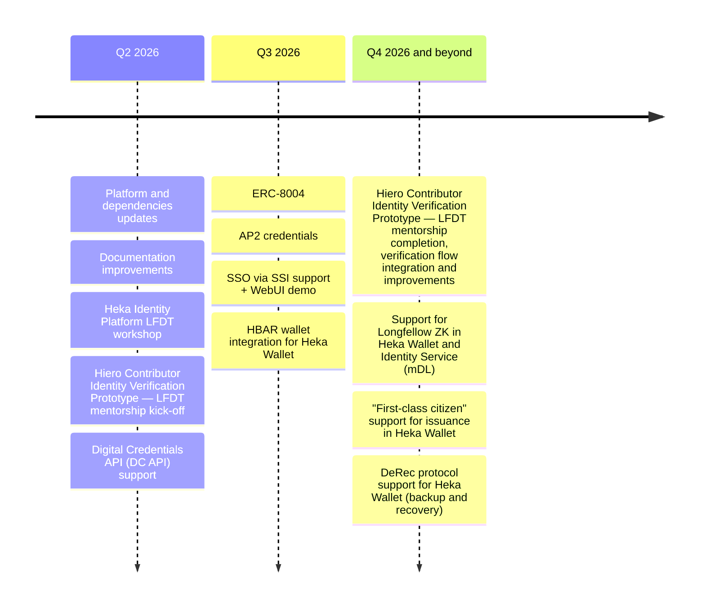

# Heka Identity Platform Roadmap

> **Note** The roadmap reflects the current development plan and is subject to change.

## Scope

- Core maintenance, platform updates and community support
- Adoption and support for emerging protocols and standards (keeping up with evolving industry)
- Foundational support for modern AI & agentic economy use cases and protocols (AP2 + x402, ERC-8004, etc.)
- Continued prototyping and integration of identity solutions in Hiero ecosystem (Contributor Identity Verification mentorship program, Hiero-specific identity features and cross-project integrations)
- Support for enterprise adoption and use cases
- Advanced ZKP support (Longfellow ZKP, etc.)

## Timeline

