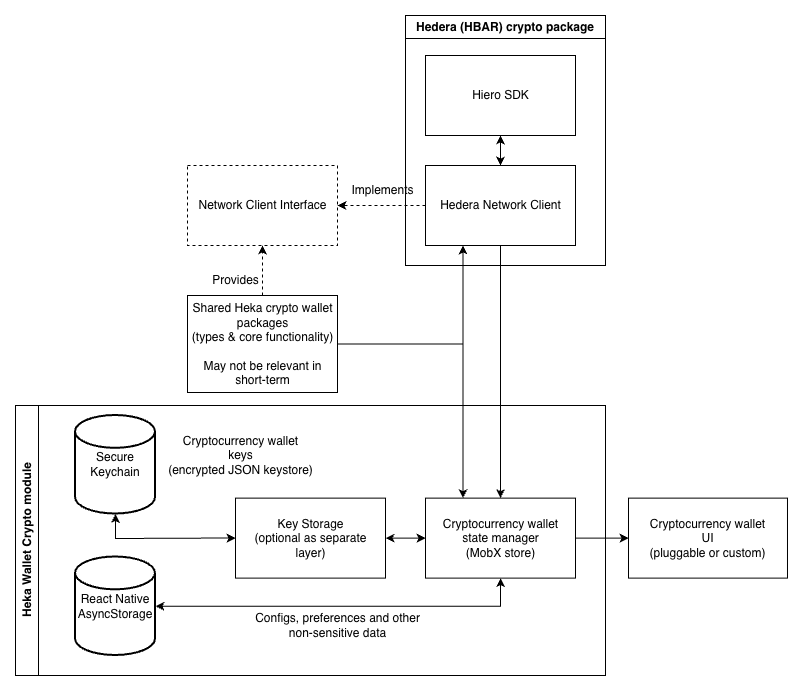

# Heka Wallet — Crypto Module Design

> **Status:** Forward-looking design. This module is not implemented in the current Heka Wallet yet and planned to be added as per the relevant roadmap.

## Overview

This document outlines a design for adding a **Hedera HBAR crypto wallet** module to the Heka Wallet, alongside its existing verifiable-credentials capability.

The Heka Wallet already integrates with the Hedera ledger for DID and AnonCreds operations via `@credo-ts/hedera`. The crypto module extends that integration with native-token (HBAR) transactions: balance, transfer, history, and fee handling.

## Goal

The goal of crypto module is to provide the following capabilities:
- Send and receive HBAR on Hedera testnet, previewnet, and mainnet.
- Track transaction status and balance with a predictable UX.
- Reuse standard key-storage primitives (Askar / Keychain / Keystore) for consistent security properties.
- Keep the design open to future extension to other networks if a need emerges, without preemptive overengineering.

## Core Components

- Shared packages
- Crypto Wallet state manager (MobX store)
- Network Client (Hedera-specific)
- Key Storage
- Reusable Crypto Wallet UI

## Shared Packages

- Shared types, utilities, and default implementations (transaction-status tracking helpers, fee formatting, tinybar/HBAR conversions, etc.).
- Platform-agnostic — usable from both the React Native app and any future tooling (e.g. CLI or backend signing helpers).
- May not be needed in the first iteration, but worth carving out as the surface grows.

## Crypto Wallet State Manager (MobX Store)

- Mobile-specific implementation that tracks wallet state (accounts, balances, transactions in flight) and feeds the React Native UI.
- Can be made reusable for a web environment later, but the initial target is mobile only.
- Responsibilities:
  - Account selection and switching.
  - Balance polling (via Mirror Node) with backoff and cache.
  - Pending-transaction tracking until consensus or timeout.
  - Surfacing errors and human-readable transaction states.

## Network Client (Hedera)

The Network Client defines the high-level interface used by the state manager and UI to perform Hedera operations. The default implementation wraps `@hiero-ledger/sdk` for transaction construction / signing and the Hedera **Mirror Node REST API** for read queries (balance, history).

Although Hedera is the only target network for the initial iteration, the interface is intentionally generic so additional networks could be added later by providing alternative implementations.

### Responsibilities

- Building, signing, and submitting transactions (HBAR transfers).
- Tracking transaction status via consensus timestamp / receipt.
- Reading account balances.
- Reading transaction history.
- Computing fees (Hedera fees are deterministic per transaction type — no gas estimation).
- Network configuration: `testnet` / `previewnet` / `mainnet`.

### Interface (high-level draft)

```ts
type AccountId = string // e.g. "0.0.12345"
type Tinybar = bigint   // 1 HBAR = 100_000_000 tinybar

enum TransactionStatus {
  NotFound = 'NotFound',
  Pending = 'Pending',
  Success = 'Success',
  Failed = 'Failed',
}

interface TransferParams {
  recipient: AccountId
  amount: Tinybar
  memo?: string
  /** Maximum acceptable fee in tinybar; transaction rejects if estimated fee exceeds this. */
  maxFee?: Tinybar
}

interface TransactionRecord {
  transactionId: string
  consensusTimestamp?: string
  status: TransactionStatus
  fee?: Tinybar
  memo?: string
}

interface NetworkClient {
  /**
   * Transfer HBAR from the active account to a recipient.
   * Resolves once consensus is reached (success or failure).
   */
  transfer(params: TransferParams): Promise<TransactionRecord>

  /**
   * Submit a pre-built / pre-signed transaction without waiting for consensus.
   * Returns the transaction ID; status is checked separately via `getTransactionStatus`.
   */
  submitTransaction(transactionBytes: Uint8Array): Promise<string>

  /**
   * Fetch the current status of a transaction by ID.
   */
  getTransactionStatus(transactionId: string): Promise<TransactionStatus>

  /**
   * Fetch HBAR balance for an account.
   */
  getBalance(account: AccountId): Promise<Tinybar>

  /**
   * Estimate the fee for a transfer of the given size and memo.
   * Hedera fees are deterministic per transaction type; this returns the fee
   * the network will charge for the next consensus round.
   */
  estimateTransferFee(params: TransferParams): Promise<Tinybar>

  /**
   * Fetch recent transactions for an account from the Mirror Node.
   */
  getTransactionHistory(account: AccountId, limit?: number): Promise<TransactionRecord[]>
}
```

### Notes

- **Fee model.** Hedera does not use gas. Each transaction type has a deterministic base fee plus per-byte costs; the SDK exposes this directly. The `estimateTransferFee` method calls into the SDK's fee schedule rather than running an "estimate gas" RPC.
- **Consensus latency.** A normal transfer reaches consensus in ~3–5 seconds. The high-level `transfer` method may wait inline for this; longer flows (HCS, HTS minting) should follow the lower-level `submitTransaction` + polling pattern.
- **Mirror Node vs. main network.** Writes go through the gRPC API exposed by the Hedera SDK; reads (balance, history) go through the Mirror Node REST API. The client owns both endpoints and keeps them consistent for a given network.
- **Account creation.** Hedera accounts are not auto-provisioned by the network — creating one requires an existing funded account to pay the creation fee. This means a fresh wallet install cannot mint its own account; either the user imports an existing account, or the app integrates an account-creation flow (see Open Questions).

## Key Storage

Hedera signing keys are typically Ed25519 (most common) or ECDSA secp256k1. The wallet must store the private key securely and expose a signing interface to the Network Client without leaking key material to the rest of the app.

### Implementation Options

**Option 1 — Encrypted JSON keystore + in-memory key management.**

- Similar to `ethers.js` and Keplr.
- Storage-agnostic; the keystore file can live in any local storage layer.
- Straightforward backup / restore via mnemonic (BIP-39 + Hedera derivation path).
- Trade-off: the decrypted private key is held in JS memory while the wallet is unlocked, with the typical RN-process risk surface.

**Option 2 — High-level `Signer` interface with no direct key access from the module.**

- Similar to Ledger / Keplr-with-hardware integrations.
- Allows leveraging:
  - Software secure enclaves (Aries Askar key entries, already used by the wallet for credential keys).
  - Hardware-backed keys (Aries Askar HSM, Ledger Nano, etc.).
- Trade-off: hardware-backed keys typically don't support mnemonic export, so backup / restore semantics differ. For a consumer crypto wallet, this is usually a non-starter unless the hardware itself is portable (Ledger Nano).

**Recommended starting point:** Option 1 for the first iteration (mnemonic backup is table-stakes for a crypto wallet), with the `Signer` interface designed cleanly enough that an Option 2 implementation can be substituted later.

### Auth Approach (lock / unlock)

- Standard pattern: unlock with password and / or biometric prompt.
- Under the hood:
  - The keystore holds private-key material in encrypted form.
  - To unlock, the user provides a password (which derives the encryption key) **or** biometric auth (which retrieves the encryption key from the OS Keychain / Keystore).
  - On lock, the in-memory decrypted key is wiped.

### Reuse of Existing Wallet Primitives

The Heka Wallet already operates an Askar-backed keystore for credential signing keys. Two reasonable approaches:

- **Reuse the existing Askar wallet** for HBAR signing keys — single backup story, single unlock UX.
- **Maintain a separate keystore** scoped to the crypto module — clearer separation of concerns at the cost of two backup / unlock paths.

The first approach is preferred unless we hit a concrete blocker.

## Reusable Crypto Wallet UI

Platform-specific React Native UI, usable either as a complete prebuilt screen set or as a library of components for apps that want a custom layout.

The exact pluggability model (which screens are configurable, how custom components are injected) follows the wallet's broader pluggable-UI strategy.

Initial screens:

- Account / portfolio view (HBAR balance, account ID, network).
- Send HBAR (recipient, amount, memo, fee preview).
- Transaction confirmation and pending / final state.
- Transaction history.
- Settings (network selection, mnemonic backup, lock).

## Design diagram


