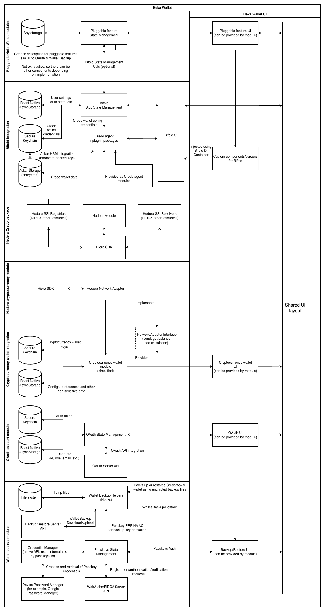

# Heka Wallet — High-Level Architecture

## Description

- This document reflects the architecture approach for the Heka Wallet app
- Includes both current and forward-looking design parts (e.g. the generic cryptocurrency module)

## Core Components

- [OWF Credo](https://github.com/openwallet-foundation/credo-ts) and its plug-in packages
  - Core framework that provides:
    - Core wallet functionality and secure storage (Aries Askar)
    - Implementations of SSI protocols and standards (Aries + DIDComm, OID4VC, VC formats)
    - Ledger integration capabilities and ready-to-use integration packages
    - Other useful features such as push notifications support, etc.
- [OWF Bifold](https://github.com/openwallet-foundation/bifold-wallet)
  - White-label app used as a base for Heka Wallet.
- Cryptocurrency wallet module
  - Generic, reusable cryptocurrency-wallet implementation designed in a network-agnostic way
  - Combined with a specific network adapter implementation and platform-specific modules (storage, UI)
  - See [Heka Wallet — Crypto Module Design (HBAR)](./crypto-module-design.md) for the design draft
- Hedera integration modules
  - Leverages the [Hedera module for OWF Credo](https://github.com/openwallet-foundation/credo-ts/tree/main/packages/hedera) (SSI / VC functionality) and the [Hiero SDK JS](https://github.com/hiero-ledger/hiero-sdk-js) (cryptocurrency module)
- OAuth integration module
  - Pluggable module that adds OAuth-based external authentication to the wallet (gated by the `ENABLE_EXTERNAL_AUTH` feature flag)
- Wallet Backup module
  - Pluggable module that backs up and restores the Credo / Askar wallet using passkey-derived encryption (gated by the `ENABLE_WALLET_BACKUP` feature flag)
  - Leverages passkeys (WebAuthn / FIDO2) with OS Credential Manager and a device password manager (e.g. Google Password Manager) for user authentication
  - Backup encryption key derivation is based on the passkey PRF HMAC output

## Architecture Diagram

> Configuration provision is omitted for simplicity.
